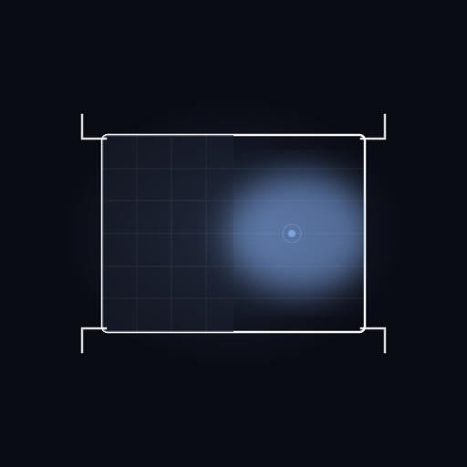
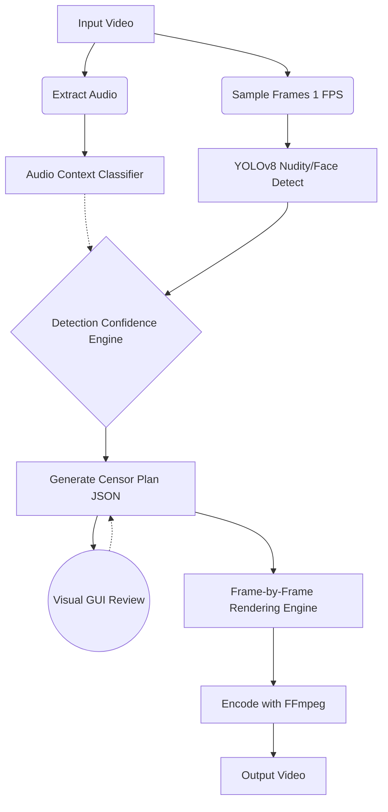

<div align="center">
  
  <h1>PureFrame</h1>
  <p><strong>Watch any movie with your family. Without cutting a single second.</strong></p>
  
</div>

## Quickstart

```bash
pip install pureframe
```

## Why PureFrame?

- **Zero Content Skips:** We don't drop frames. We use temporally smoothed spatial bounding boxes and dynamic localized blurring. The narrative, timing, and audio remain completely untouched.
- **100% Local & Private:** No cloud APIs, no subscriptions. Everything runs directly on your hardware, respecting your privacy and avoiding cloud compute costs.
- **Format Agnostic:** PureFrame doesn't rely on curated subtitle files or crowd-sourced timestamp databases. It visually analyzes the frames, working on obscure indie films just as well as blockbusters.
- **Audio-Context Aware:** Uses zero-shot audio classification to differentiate between innocent and explicit sounds, minimizing false positives (e.g., distinguishing a loud gym from an explicit scene).
- **Edit Before You Apply:** Generates an intermediate JSON `.censorplan` file that lets you visually review and whitelist flags in a visual timeline editor before rendering.

## How it works



## Comparison

| Feature | PureFrame | VidAngel / ClearPlay | Manual Editing (Premiere/DaVinci) |
|---|---|---|---|
| Cuts video length? | **No** (Local blurring) | Yes (Skips scenes) | Optional |
| Subscription fee | **Free / Open Source** | $9.99/mo | High software cost |
| Requires cloud? | **No** (Fully local) | Yes | No |
| Works on any file? | **Yes** (Any local MP4/MKV) | No (Only curated list) | Yes |
| Crowd-sourced reliance | **None** (AI Vision) | Heavy | N/A |

## FAQ

**Is this legal?**
Yes. In the United States, the [Family Movie Act of 2005](https://en.wikipedia.org/wiki/Family_Movie_Act_of_2005) explicitly legalized the creation of technology that sanitizes objectionable content from legally acquired movies for private, in-home viewing. See [docs/legal.md](docs/legal.md) for more details.

**Does it work offline?**
100%. After the initial download of the AI models (which happens automatically the first time you run it), PureFrame never makes a network request.

**Will it ruin the movie?**
PureFrame applies localized blurring precisely over the flagged content (or black boxes). It tracks the content and applies Gaussian temporal smoothing so the blur doesn't nervously jitter. Because it never cuts the audio or video timeline, the pacing and narrative flow remain exactly as the director intended.

**Can I review what gets censored before applying?**
Absolutely. By running `pureframe plan mymovie.mp4`, it generates a `.censorplan.json` file. You can open this in the PureFrame Tauri GUI to visually scrub through flagged scenes, keep them, or whitelist them with one click before committing to the render.

## Performance Benchmarks

*Note: Benchmarks run on a 90-minute 1080p H.264 movie.*

| Hardware | 90-min 1080p movie | Profile |
|---|---|---|
| RTX 4090 | ~12 min | HIGH |
| RTX 3060 | ~24 min | MEDIUM |
| GTX 1650 (4GB) | ~55 min | LOW |
| M2 Pro | ~28 min | MEDIUM |
| 12-core CPU only | ~3 hours | CPU |

See [BENCHMARKS.md](BENCHMARKS.md) for deeper metrics.

## Roadmap

- [x] Phase 1: Core CLI & Pipeline Architecture
- [x] Phase 2: YOLOv8 Integration & Tracking
- [x] Phase 3: Batch Processing & Crash Recovery
- [x] Phase 4: Plan/Apply Decoupling
- [x] Phase 5: Tauri Desktop GUI
- [ ] Phase 6: Plex Plugin Integration
- [ ] Phase 7: Hardware Encoding Enhancements (NVENC/QSV)
- [ ] Phase 8: Whisper-based Subtitle Profanity Filtering

## Community & Contributing

- [Contributing Guide](docs/CONTRIBUTING.md)
- [Join the Discord Community](https://discord.gg/guildforge) (Built with GuildForge!)
- [](https://opensource.org/licenses/MIT)

PureFrame modifies copies of media you already legally possess. We do not host, distribute, or share media.
