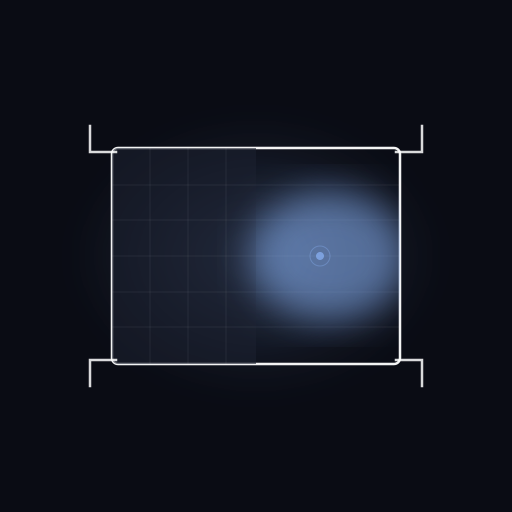

<div align="center">
  
  <h1>PureFrame</h1>
  <p>Blur explicit scenes without cutting anything out.</p>

  <a href="#install"></a>
  <a href="LICENSE"></a>
  <a href="https://github.com/xenoaitham/PureFrame/actions"></a>
  

  <br /><br />
  
  <p><em>Output from PureFrame. <a href="https://xenoaitham.github.io/PureFrame/demo/">Demo</a> · <a href="screenshots/">More screenshots</a></em></p>
</div>


PureFrame blurs nudity, sexual activity, and intense kissing in video files. The blur follows the detected areas as they move. Nothing gets cut, so you keep the dialogue and the rest of the scene.

It works with local MP4, MKV, AVI, and WebM files. The first run downloads about 400–500 MB of models; after that, processing works offline. It doesn't upload videos or collect usage data.

## Install

The [releases page](https://github.com/xenoaitham/PureFrame/releases/latest) has the desktop app for Windows, macOS, and Linux, plus command-line builds that don't need Python. The desktop app is still experimental.

For the Python version, you'll need Python 3.11+ and FFmpeg on your PATH:

```bash
pip install pureframe
```

A GPU helps, but isn't required. The standalone Windows build already includes FFmpeg. For the macOS and Linux command-line builds, you'll need to install it yourself. Intel Mac users can use pip or the desktop app.

The downloads aren't code-signed yet. Windows and macOS may warn you when you open them. Each release includes `SHA256SUMS.txt` to check the download. More setup details are in the [installation guide](docs/installation.md).

## Try it

```bash
pureframe process movie.mp4 --output movie_clean.mp4
```

Or split it into steps to see what got flagged before rendering:

```bash
pureframe plan movie.mp4
pureframe preview movie.censorplan.json
```

This saves a JSON plan and makes a contact sheet of the flagged shots. If shot #3 shouldn't be blurred, for example:

```bash
pureframe plan-whitelist movie.censorplan.json 3
```

You can open the whole plan with `pureframe plan-edit movie.censorplan.json`. When you're done:

```bash
pureframe apply movie.mp4 movie.censorplan.json
```

Detection still gets things wrong. Swimwear can get flagged, and dark scenes or brief flashes can be missed. Review the results if you're using this for family viewing. The [known limitations](docs/KNOWN_LIMITATIONS.md) go into more detail.

### A couple of settings

Strictness defaults to `medium`. Use `low` for less censoring or `high` for more:

```bash
pureframe process movie.mp4 --strictness high
```

The default content type is `live-action`. There are also `animation`, `anime`, `low-light`, `art`, and `medical` profiles:

```bash
pureframe process cartoon.mp4 --content-type animation
```

For manual thresholds (`--threshold`) and profile details, see [calibration](docs/CALIBRATION.md) or the [CLI reference](docs/cli-reference.md).

## Desktop app

Queue videos, check progress, and go through the flagged shots on a timeline. You can change which shots get blurred and compare the before and after.

| Queue | Editor |
|---|---|
|  |  |

## Under the hood

PySceneDetect finds shot boundaries, NudeNet checks frames for nudity, and CLIP looks at the scene for sexual activity. When the picture alone isn't clear enough, PANNs checks the audio too. The results go into the JSON plan, then FFmpeg renders the blurs. There's more in the [architecture docs](docs/architecture.md).

The benchmarks so far use a synthetic 30-second clip. On my i5-10400F / RTX 3060 machine, the LOW, MEDIUM, and HIGH profiles took 15.1, 16.2, and 23.7 seconds. The CPU run took 3 seconds but detected nothing, so there was no blur to render. These numbers don't tell us how long a full movie will take.

You can run the same test with:

```bash
pureframe bench --duration 30 --reps 3 -o bench-report.json
```

The timings are medians of three runs on Pop!_OS. See [BENCHMARKS.md](BENCHMARKS.md) and the [performance notes](docs/performance.md) for the breakdown.

## Working on it

```bash
git clone https://github.com/xenoaitham/PureFrame.git
cd PureFrame
pip install -e ".[dev]"
```

To start the desktop app from the checkout:

```bash
cd gui
npm install
npm run tauri dev
```

[CONTRIBUTING.md](CONTRIBUTING.md) has the contribution details. Issues labeled `good first issue` are a place to start.

PureFrame only handles local, unencrypted files and doesn't bypass DRM. It's intended for private use with videos you're allowed to have. See [legal](docs/legal.md), [privacy](docs/privacy.md), and [security](SECURITY.md).

---

Built with [NudeNet](https://github.com/notAI-tech/NudeNet), [PySceneDetect](https://github.com/Breakthrough/PySceneDetect), [CLIP](https://github.com/openai/CLIP), [PANNs](https://github.com/qiuqiangkong/audioset_tagging_cnn), [FFmpeg](https://ffmpeg.org/), and [Tauri](https://tauri.app/). Thanks to their maintainers.


[MIT license](LICENSE).
